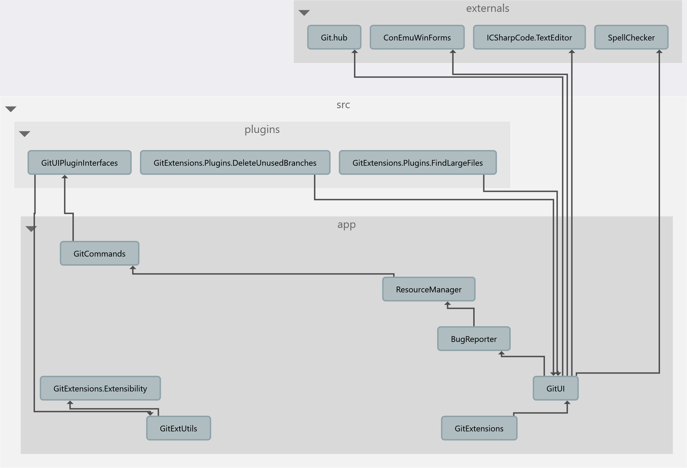

# Architecture

This section describes the high-level architecture of GitExtensions, including its main components, dependencies, and how they interact.

## High-Level Overview

GitExtensions is built using a modular architecture that separates concerns into distinct layers: the core Git operations, the user interface, utilities, and extensibility features. The system is designed for maintainability, extensibility, and performance.

The architecture diagram illustrates the main components and their relationships.

## Main Components

### 1. Core Layer (GitCommands)
- **Purpose**: Handles direct interactions with Git repositories using the Git command-line interface.
- **Key Classes**: `GitModule`, `GitCommands`, command wrappers for operations like commit, push, pull, etc.
- **Responsibilities**:
  - Execute Git commands and parse outputs.
  - Manage repository state and metadata.
  - Provide abstractions for Git operations.
- **Location**: `src/app/GitCommands/`

### 2. User Interface Layer (GitUI)
- **Purpose**: Provides the graphical user interface for user interactions.
- **Key Components**:
  - `FormBrowse`: Main browsing dialog for repository navigation.
  - `GitUICommands`: Facade for starting dialogs and commands.
  - Various forms for commit, merge, settings, etc.
- **Responsibilities**:
  - Render UI elements and handle user input.
  - Integrate with core layer for operations.
  - Manage events and notifications.
- **Location**: `src/app/GitUI/`

### 3. Utilities (GitExtUtils)
- **Purpose**: Common utilities and helpers used across the application.
- **Examples**: File system operations, string utilities, validation helpers.
- **Responsibilities**: Provide reusable code for tasks like path resolution, UI helpers, etc.
- **Location**: `src/app/GitExtUtils/`

### 4. Extensibility (Plugins)
- **Purpose**: Allows third-party extensions to enhance functionality.
- **Key Interfaces**: `IGitPlugin`, `IGitPluginForRepository`, `IGitPluginForCommit`.
- **Responsibilities**:
  - Define plugin lifecycle (Register, Unregister, Execute).
  - Provide settings and configuration.
  - Enable custom tools and integrations.
- **Location**: `src/app/GitExtensions.Extensibility/`, `src/plugins/`

### 5. Externals
- **Purpose**: Third-party libraries integrated into GitExtensions.
- **Examples**:
  - `ICSharpCode.TextEditor`: For syntax highlighting and editing.
  - `ConEmu`: For embedded console support.
  - `Git.hub`: For GitHub integration.
  - `NetSpell.SpellChecker`: For spell checking.
- **Responsibilities**: Provide specialized functionality like advanced editing, console emulation, etc.
- **Location**: `externals/`

### 6. Resource Management
- **Purpose**: Manage resources such as translations, themes, and icons.
- **Key Components**: `ResourceManager`, theme loading, localization.
- **Responsibilities**: Handle internationalization, theming, and resource loading.
- **Location**: `src/app/ResourceManager/`

## Dependencies and Interactions

- **GitCommands ↔ Git**: The core layer directly invokes Git commands via the command line.
- **GitUI ↔ GitCommands**: UI components call GitCommands for repository operations.
- **Plugins ↔ GitUI**: Plugins register with GitUI and respond to events.
- **Externals**: Integrated as needed, e.g., TextEditor for file viewing.

## Build System

The project uses MSBuild with Visual Studio solutions. Key projects include:
- `GitExtensions.csproj`: Main application.
- `GitUI.csproj`: UI components.
- `GitCommands.csproj`: Core Git operations.
- Various plugin projects under `src/plugins/`.

For build instructions, see [DeveloperGuide](DeveloperGuide.md).

## Design Principles

- **Modularity**: Components are loosely coupled for easy maintenance.
- **Extensibility**: Plugin system allows customization.
- **Performance**: Optimized for responsiveness in UI interactions.
- **User-Centric**: Focus on intuitive interfaces for Git tasks.

For more details on specific APIs, refer to [API Documentation](API.md).